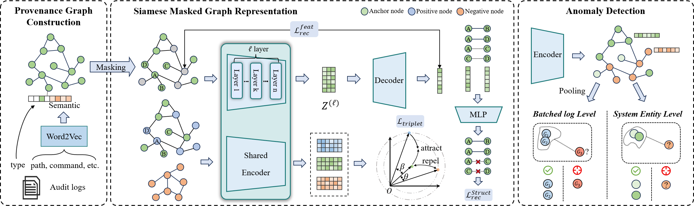

# Polaris
This is official code for the Polaris framework.

## Polaris: Detecting Advanced Persistent Threat on Provenance Graphs via Siamese Masked Graph Representation

we propose Polaris, a novel semi-supervised detection framework based on provenance graphs. At its core is a Siamese Graph Masked Autoencoder (SGMAE). This model leverages masked graph representation learning to model system entities and benign behaviors, while concurrently employing an angular contrastive learning mechanism that utilizes a small number of attack samples to separate the embeddings of easily confused benign and malicious behaviors. Finally,
an anomaly detection algorithm is applied in the learned embedding space to identify APT attacks. 

## Requirements
```
Python 3.8
PyTorch 1.12.1
DGL 1.0.0
Scikit-learn 1.2.2
networkx 3.1
tqdm 4.67.1
gensim 4.3.1
```

## Datasets
### StreamSpot
- Download and unzip `all.tar.gz` dataset from [StreamSpot](https://github.com/sbustreamspot/sbustreamspot-data).
- you will get `all.tsv`.
- Copy `all.tsv` to `./data/streamspot/`
- go to directory `datahandle` and run `streamspot_parser.py` to get 600 graph data files in JSON format.
### Unicorn
- Download and unzip`attack_baseline.tar.gz` and `benign.tar.gz`[Unicorn wget](https://dataverse.harvard.edu/dataset.xhtml?persistentId=doi:10.7910/DVN/IA8UOS)
- you will get many `*.log` files
- Copy `.log`file to `data/wget/raw/`. Ignore contents in `base` and `stream`.
- go to directory `datahandle` and run `wget_parser.py` to get 150 graph data files in JSON format.
### Darpa TC E3 Sub-datasets
- Go to [Darpa TC E3 datasets](https://github.com/darpa-i2o/Transparent-Computing)
- Download and unzip ta1-trace-e3-official-1.json.tar.gz into data/trace/.
- Download and unzip ta1-theia-e3-official-6r.json.tar.gz into data/theia/.
- Download and unzip ta1-cadets-e3-official-2.json.tar.gz and ta1-cadets-e3-official.json.tar.gz into data/cadets/
- go to directory `datahandle` and run `darpa_trace.py` to get trainset and testset.
- Polaris use labels from [ThreaTrace](https://github.com/threaTrace-detector/threaTrace).Go to the repo and download the labels file `.txt` in folder `ground_truth`.Put the labels file into data folder.For example, put `trace.txt` into `data/trace/`.
## Run Experiments
To facilitate evaluation, we have saved the processed dataset and trained weights to /data/dataset.Just Run scripts:
```
python ./evaluate.py --dataset **selected dataset**
```
##

## Run Training
To train the model from scratch, run:
```
python ./train.py --dataset **selected dataset**
```
